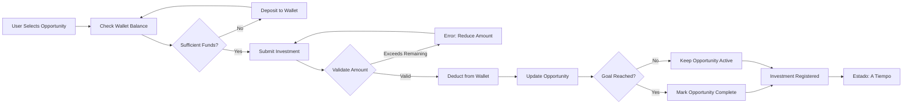

## List All User Investments (Admin)

```http
GET /api/listarOportunidadUsuario
```

Retrieves all user investments in the system.

<Warning>
Admin authentication required
</Warning>

<RequestExample>
```bash cURL
curl -X GET "https://api.investgo.com/api/listarOportunidadUsuario" \
  -H "Authorization: Bearer ADMIN_TOKEN"
```
</RequestExample>

<ResponseExample>
```json 200 - Success
[
  {
    "idOportunidadUsuario": 1,
    "idOportunidad": 5,
    "montoInvertido": 5000.00,
    "ganancia": 350.00,
    "estado": "A Tiempo",
    "fecha": "2024-03-15",
    "idEmpresa": 2,
    "usuarioId": 10,
    "oportunidadInversion": {
      "idOportunidad": 5,
      "titulo": "Factoring - Exportación Textil",
      "tasaInteres": 7.0,
      "monto": 50000.00,
      "montoRecaudado": 30000.00
    },
    "empresa": {
      "idEmpresa": 2,
      "razonSocial": "Textiles del Sur SAC",
      "ruc": "20123456789"
    },
    "usuario": {
      "id": 10,
      "nombre": "Juan",
      "apellidoPa": "Pérez",
      "correo": "juan.perez@email.com"
    }
  }
]
```
</ResponseExample>

---

## List Users Invested in an Opportunity

```http
GET /api/listarOpoUsuXOpo/{idOportunidad}
```

Retrieves all users who have invested in a specific investment opportunity.

<ParamField path="idOportunidad" type="integer" required>
  Investment opportunity ID
</ParamField>

<RequestExample>
```bash cURL
curl -X GET "https://api.investgo.com/api/listarOpoUsuXOpo/5" \
  -H "Authorization: Bearer YOUR_TOKEN"
```
</RequestExample>

<ResponseExample>
```json 200 - Success
[
  {
    "idOportunidadUsuario": 1,
    "idOportunidad": 5,
    "montoInvertido": 5000.00,
    "ganancia": 350.00,
    "estado": "A Tiempo",
    "fecha": "2024-03-15",
    "usuarioId": 10,
    "usuario": {
      "id": 10,
      "nombre": "Juan",
      "apellidoPa": "Pérez",
      "correo": "juan.perez@email.com"
    }
  },
  {
    "idOportunidadUsuario": 2,
    "idOportunidad": 5,
    "montoInvertido": 10000.00,
    "ganancia": 700.00,
    "estado": "A Tiempo",
    "fecha": "2024-03-16",
    "usuarioId": 15,
    "usuario": {
      "id": 15,
      "nombre": "María",
      "apellidoPa": "González",
      "correo": "maria.gonzalez@email.com"
    }
  }
]
```
</ResponseExample>

---

## List Current User's Investments

```http
GET /api/listarOpoUsuXIdi
```

Retrieves all investments made by the authenticated user.

<Warning>
Requires authenticated session. Uses session to identify current user.
</Warning>

<RequestExample>
```bash cURL
curl -X GET "https://api.investgo.com/api/listarOpoUsuXIdi" \
  -H "Authorization: Bearer YOUR_TOKEN" \
  -H "Cookie: JSESSIONID=your_session_id"
```
</RequestExample>

<ResponseExample>
```json 200 - Success
[
  {
    "idOportunidadUsuario": 1,
    "idOportunidad": 5,
    "montoInvertido": 5000.00,
    "ganancia": 350.00,
    "estado": "A Tiempo",
    "fecha": "2024-03-15",
    "idEmpresa": 2,
    "usuarioId": 10,
    "oportunidadInversion": {
      "idOportunidad": 5,
      "titulo": "Factoring - Exportación Textil",
      "descripcion": "Financiamiento de facturas de exportación",
      "tasaInteres": 7.0,
      "monto": 50000.00,
      "montoRecaudado": 30000.00,
      "plazo": 90,
      "fechaInicio": "2024-03-01",
      "fechaFin": "2024-05-30"
    },
    "empresa": {
      "idEmpresa": 2,
      "razonSocial": "Textiles del Sur SAC",
      "ruc": "20123456789"
    }
  },
  {
    "idOportunidadUsuario": 3,
    "idOportunidad": 8,
    "montoInvertido": 8000.00,
    "ganancia": 480.00,
    "estado": "A Tiempo",
    "fecha": "2024-03-20",
    "idEmpresa": 5,
    "usuarioId": 10,
    "oportunidadInversion": {
      "idOportunidad": 8,
      "titulo": "Factoring - Construcción",
      "tasaInteres": 6.0,
      "monto": 100000.00,
      "montoRecaudado": 45000.00
    }
  }
]
```
</ResponseExample>

---

## List Current User's Investments (Paginated)

```http
GET /api/listarOpoUsuXIdi/{page}
```

Retrieves paginated investments made by the authenticated user.

<Warning>
Requires authenticated session. Returns 6 investments per page.
</Warning>

<ParamField path="page" type="integer" required>
  Page number (0-based index)
</ParamField>

<RequestExample>
```bash cURL
curl -X GET "https://api.investgo.com/api/listarOpoUsuXIdi/0" \
  -H "Authorization: Bearer YOUR_TOKEN" \
  -H "Cookie: JSESSIONID=your_session_id"
```
</RequestExample>

<ResponseExample>
```json 200 - Success
{
  "content": [
    {
      "idOportunidadUsuario": 1,
      "idOportunidad": 5,
      "montoInvertido": 5000.00,
      "ganancia": 350.00,
      "estado": "A Tiempo",
      "fecha": "2024-03-15",
      "idEmpresa": 2,
      "usuarioId": 10,
      "oportunidadInversion": {
        "idOportunidad": 5,
        "titulo": "Factoring - Exportación Textil",
        "tasaInteres": 7.0,
        "monto": 50000.00,
        "montoRecaudado": 30000.00
      }
    }
  ],
  "pageable": {
    "pageNumber": 0,
    "pageSize": 6,
    "sort": {
      "sorted": false,
      "unsorted": true,
      "empty": true
    },
    "offset": 0,
    "paged": true,
    "unpaged": false
  },
  "totalPages": 3,
  "totalElements": 15,
  "last": false,
  "size": 6,
  "number": 0,
  "sort": {
    "sorted": false,
    "unsorted": true,
    "empty": true
  },
  "numberOfElements": 6,
  "first": true,
  "empty": false
}
```
</ResponseExample>

---

## Register New Investment

```http
POST /api/registaInversionUsuario
```

Register a new investment in a factoring opportunity. This endpoint performs multiple operations:
1. Validates user has sufficient wallet balance
2. Deducts investment amount from user's wallet
3. Updates the opportunity's collected amount
4. Marks opportunity as "No Activo" if funding goal is reached
5. Creates the investment record

<Warning>
Requires authenticated session. The system automatically:
- Assigns the user ID from the session
- Sets the investment date to current date
- Sets the investment status to "A Tiempo"
</Warning>

<ParamField body="idOportunidad" type="integer" required>
  Investment opportunity ID to invest in
</ParamField>

<ParamField body="montoInvertido" type="double" required>
  Amount to invest (must not exceed wallet balance or remaining opportunity amount)
</ParamField>

<ParamField body="ganancia" type="double" required>
  Expected profit from the investment
</ParamField>

<ParamField body="idEmpresa" type="integer" required>
  Company ID associated with the investment opportunity
</ParamField>

<RequestExample>
```bash cURL
curl -X POST "https://api.investgo.com/api/registaInversionUsuario" \
  -H "Content-Type: application/json" \
  -H "Authorization: Bearer YOUR_TOKEN" \
  -H "Cookie: JSESSIONID=your_session_id" \
  -d '{
    "idOportunidad": 5,
    "montoInvertido": 5000.00,
    "ganancia": 350.00,
    "idEmpresa": 2
  }'
```
</RequestExample>

<ResponseExample>
```json 200 - Success
{
  "mensaje": "La inversion se realizo con exito",
  "oportunidadInversion": {
    "idOportunidadUsuario": 1,
    "idOportunidad": 5,
    "montoInvertido": 5000.00,
    "ganancia": 350.00,
    "estado": "A Tiempo",
    "fecha": "2024-03-15",
    "idEmpresa": 2,
    "usuarioId": 10
  }
}
```

```json 200 - Funding Goal Completed
{
  "mensaje": "La inversion se realizo con exito",
  "completado": "Felicidades!, con su inversion se alcanzo la meta.",
  "oportunidadInversion": {
    "idOportunidadUsuario": 1,
    "idOportunidad": 5,
    "montoInvertido": 5000.00,
    "ganancia": 350.00,
    "estado": "A Tiempo",
    "fecha": "2024-03-15",
    "idEmpresa": 2,
    "usuarioId": 10
  }
}
```

```json 409 - Insufficient Wallet Balance
{
  "mensaje": "No cuenta con saldo suficiente en su cartera, ¿Desea depositar?."
}
```

```json 400 - Investment Exceeds Remaining Amount
{
  "mensaje": "La Inversion Excede El Monto Solicitado. Ingrese un inversion menor o igual a: 15000.00"
}
```

```json 400 - Opportunity Not Found
{
  "mensaje": "No se encontro la oportunidad de inversion"
}
```

```json 409 - Wallet Update Failed
{
  "mensaje": "No se pudo actualizar los datos de la cartera"
}
```

```json 400 - Opportunity Update Failed
{
  "mensaje": "Error Al Actualizar El Monto Recaudado"
}
```

```json 400 - Investment Registration Failed
{
  "mensaje": "No se registro la inversion"
}
```

```json 500 - Server Error
{
  "mensaje": "Error al registrar la Inversion",
  "error": "[detailed error message]"
}
```
</ResponseExample>

---

## User Investment Schema

<ResponseField name="idOportunidadUsuario" type="integer">
  User investment unique identifier
</ResponseField>

<ResponseField name="idOportunidad" type="integer">
  Investment opportunity ID
</ResponseField>

<ResponseField name="oportunidadInversion" type="object">
  Investment opportunity details
  <Expandable title="properties">
    <ResponseField name="idOportunidad" type="integer">
      Opportunity ID
    </ResponseField>
    <ResponseField name="titulo" type="string">
      Opportunity title
    </ResponseField>
    <ResponseField name="descripcion" type="string">
      Opportunity description
    </ResponseField>
    <ResponseField name="tasaInteres" type="double">
      Interest rate percentage
    </ResponseField>
    <ResponseField name="monto" type="double">
      Total funding goal amount
    </ResponseField>
    <ResponseField name="montoRecaudado" type="double">
      Amount collected so far
    </ResponseField>
    <ResponseField name="plazo" type="integer">
      Investment term in days
    </ResponseField>
    <ResponseField name="fechaInicio" type="date">
      Opportunity start date
    </ResponseField>
    <ResponseField name="fechaFin" type="date">
      Opportunity end date
    </ResponseField>
  </Expandable>
</ResponseField>

<ResponseField name="montoInvertido" type="double">
  Amount invested by the user
</ResponseField>

<ResponseField name="ganancia" type="double">
  Expected profit from the investment
</ResponseField>

<ResponseField name="estado" type="string">
  Investment status (e.g., "A Tiempo" for on-time)
</ResponseField>

<ResponseField name="fecha" type="date">
  Investment date (yyyy-MM-dd format)
</ResponseField>

<ResponseField name="idEmpresa" type="integer">
  Company ID associated with the opportunity
</ResponseField>

<ResponseField name="empresa" type="object">
  Company details
  <Expandable title="properties">
    <ResponseField name="idEmpresa" type="integer">
      Company ID
    </ResponseField>
    <ResponseField name="razonSocial" type="string">
      Company legal name
    </ResponseField>
    <ResponseField name="ruc" type="string">
      Company tax ID (RUC)
    </ResponseField>
  </Expandable>
</ResponseField>

<ResponseField name="usuarioId" type="long">
  User ID who made the investment
</ResponseField>

<ResponseField name="usuario" type="object">
  User details
  <Expandable title="properties">
    <ResponseField name="id" type="long">
      User ID
    </ResponseField>
    <ResponseField name="nombre" type="string">
      User's first name
    </ResponseField>
    <ResponseField name="apellidoPa" type="string">
      User's paternal last name
    </ResponseField>
    <ResponseField name="correo" type="string">
      User's email
    </ResponseField>
  </Expandable>
</ResponseField>

---

## Investment Validation Rules

The system enforces strict validation rules when registering investments:

### Wallet Balance Validation

<Warning>
- User must have sufficient balance in their wallet (cartera)
- Investment amount is deducted from wallet immediately
- If insufficient balance, transaction fails with status code 409
</Warning>

**Example:**
- User wallet balance: 10,000
- Investment amount: 12,000
- Result: ❌ Error: "No cuenta con saldo suficiente en su cartera, ¿Desea depositar?."

### Opportunity Amount Validation

<Warning>
- Investment cannot exceed the remaining amount needed for the opportunity
- Remaining amount = Opportunity goal - Amount already collected
- If exceeded, transaction fails with status code 400
</Warning>

**Example:**
- Opportunity goal: 50,000
- Already collected: 40,000
- Remaining: 10,000
- Investment attempt: 15,000
- Result: ❌ Error: "La Inversion Excede El Monto Solicitado. Ingrese un inversion menor o igual a: 10000.00"

### Funding Goal Completion

<Note>
When an investment completes the funding goal:
- The opportunity status is set to "No Activo"
- No more investments can be made in this opportunity
- A special success message is returned: "Felicidades!, con su inversion se alcanzo la meta."
</Note>

**Example:**
- Opportunity goal: 50,000
- Already collected: 45,000
- New investment: 5,000
- Total after investment: 50,000 (equals goal)
- Result: ✓ Success + opportunity marked complete

---

## Investment Flow

### Complete Investment Process

1. **User Views Opportunities**
   ```bash
   GET /api/listarOportunidad
   ```
   User browses available investment opportunities

2. **Check Wallet Balance**
   ```bash
   GET /api/detalleCartera
   ```
   User verifies they have sufficient funds

3. **Calculate Investment**
   - User determines investment amount
   - System calculates expected profit based on interest rate
   - Example: 5,000 investment × 7% interest = 350 profit

4. **Submit Investment**
   ```bash
   POST /api/registaInversionUsuario
   {
     "idOportunidad": 5,
     "montoInvertido": 5000.00,
     "ganancia": 350.00,
     "idEmpresa": 2
   }
   ```

5. **System Processing**
   - ✓ Validate wallet balance (5,000 ≤ wallet balance)
   - ✓ Validate opportunity remaining amount
   - ✓ Deduct from wallet: wallet balance - 5,000
   - ✓ Update opportunity: montoRecaudado + 5,000
   - ✓ Check if goal reached (montoRecaudado == monto)
   - ✓ Create investment record

6. **View Investment History**
   ```bash
   GET /api/listarOpoUsuXIdi
   ```
   User can see all their investments

### Investment Lifecycle



---

## Atomic Transaction Handling

The investment registration process is designed to be atomic:

<Warning>
**Transaction Flow:**
1. Update wallet balance (deduct investment)
2. Update opportunity collected amount
3. Create investment record

**All operations must succeed or all fail together.** If any step fails, previous changes should be rolled back (though the current implementation may not fully guarantee this - consider adding proper transaction management).
</Warning>

### Error Recovery

| Error Scenario | System Response | User Action |
|---------------|-----------------|-------------|
| Insufficient wallet balance | 409 Conflict | Deposit funds to wallet |
| Investment exceeds remaining | 400 Bad Request | Reduce investment amount |
| Wallet update failed | 409 Conflict | Retry or contact support |
| Opportunity update failed | 400 Bad Request | Retry or contact support |
| Investment record failed | 400 Bad Request | Verify wallet & try again |
| Opportunity not found | 400 Bad Request | Verify opportunity exists |

---

## Integration with Other Features

### Wallet Integration

Investments directly impact user wallet balances:

**Before Investment:**
- Wallet balance: 25,000

**After 5,000 Investment:**
- Wallet balance: 20,000
- Investment record created
- Opportunity collected amount increased by 5,000

### Investment Opportunities Integration

Each investment updates the parent opportunity:

**Before Investment:**
```json
{
  "idOportunidad": 5,
  "monto": 50000.00,
  "montoRecaudado": 30000.00,
  "enable": "Activo"
}
```

**After 5,000 Investment:**
```json
{
  "idOportunidad": 5,
  "monto": 50000.00,
  "montoRecaudado": 35000.00,  // Increased by 5,000
  "enable": "Activo"  // Still active (not fully funded)
}
```

**After Final Investment Reaches Goal:**
```json
{
  "idOportunidad": 5,
  "monto": 50000.00,
  "montoRecaudado": 50000.00,  // Fully funded
  "enable": "No Activo"  // Now closed to new investments
}
```

### Portfolio Management

Users can track their investment portfolio:

<CodeGroup>
```bash View All Investments
curl -X GET "https://api.investgo.com/api/listarOpoUsuXIdi" \
  -H "Authorization: Bearer YOUR_TOKEN"
```

```bash View Paginated Investments
curl -X GET "https://api.investgo.com/api/listarOpoUsuXIdi/0" \
  -H "Authorization: Bearer YOUR_TOKEN"
```

```bash Calculate Total Invested
# Sum all montoInvertido from user's investments
```

```bash Calculate Expected Returns
# Sum all ganancia from user's investments
```
</CodeGroup>

---

## Investment Status Tracking

The `estado` field tracks the investment status:

| Status | Description |
|--------|-------------|
| A Tiempo | Investment is on schedule, no delays |

<Note>
Currently, all new investments are automatically set to "A Tiempo". Future enhancements may include additional statuses such as "Retrasado" (delayed), "Pagado" (paid), or "En Mora" (in default).
</Note>

---

## Pagination Details

The paginated endpoint (`/api/listarOpoUsuXIdi/{page}`) returns 6 investments per page:

<ParamField query="page" type="integer">
  Page number (0-based index)
  - Page 0: Investments 1-6
  - Page 1: Investments 7-12
  - Page 2: Investments 13-18
  - etc.
</ParamField>

**Response includes:**
- `content`: Array of investments for the current page
- `totalPages`: Total number of pages
- `totalElements`: Total number of investments
- `first`: Whether this is the first page
- `last`: Whether this is the last page
- `numberOfElements`: Number of items in current page

---

## Best Practices

### For Users

1. **Check Balance First**
   Always verify your wallet has sufficient funds before attempting to invest

2. **Review Remaining Amount**
   Check how much funding the opportunity still needs to avoid investment rejection

3. **Calculate Expected Returns**
   Use the opportunity's interest rate to calculate your expected profit

4. **Track Your Portfolio**
   Regularly review your investments using the list endpoints

### For Developers

1. **Handle Errors Gracefully**
   Provide clear user feedback for validation errors and insufficient balance

2. **Show Real-Time Updates**
   Update UI immediately after successful investment to show new wallet balance

3. **Implement Retry Logic**
   For transient failures (wallet/opportunity update), implement retry with exponential backoff

4. **Use Pagination**
   For users with many investments, use the paginated endpoint to improve performance

5. **Validate Client-Side**
   Check wallet balance and remaining amount before submitting to reduce failed requests