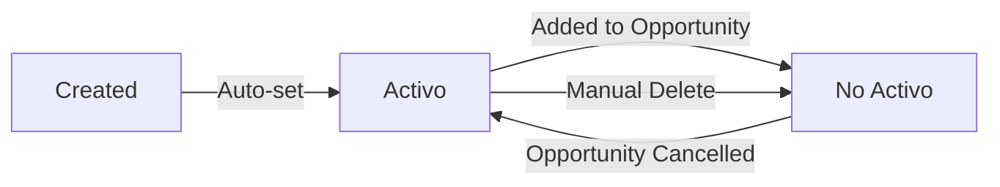

## Overview

The Invoice Management feature provides comprehensive functionality for registering and managing company invoices that will be used for factoring and bundled into investment opportunities. The system automatically generates unique invoice codes in the format F-001, F-002, etc., and tracks invoice lifecycle from creation through payment.

## Key Capabilities

<CardGroup cols={2}>
  <Card title="Auto-Generated Codes" icon="barcode">
    Automatic invoice numbering with F-XXX format for easy identification and tracking
  </Card>
  <Card title="Company Association" icon="building">
    Link each invoice to a specific company for organized management
  </Card>
  <Card title="Date Tracking" icon="calendar-days">
    Track both emission and payment dates for complete lifecycle visibility
  </Card>
  <Card title="Status Management" icon="toggle-on">
    Enable/disable invoices based on availability for investment opportunities
  </Card>
</CardGroup>

## Data Model

The `Factura` entity contains the following key fields:

| Field | Type | Description |
|-------|------|-------------|
| `idFactura` | int | Unique identifier (auto-generated) |
| `codFactura` | String | Invoice code (F-001, F-002, etc.) - auto-generated |
| `monto` | double | Invoice amount |
| `fechaEmision` | Date | Date invoice was issued (auto-set to current date) |
| `fechaPago` | Date | Expected or actual payment date |
| `enable` | String | Status: "Activo" (available) or "No Activo" (used/disabled) |
| `descripcion` | String | Invoice description or notes |
| `empresa` | Empresa | Associated company entity |

<Note>
  When an invoice is bundled into an investment opportunity, its `enable` status is automatically changed to "No Activo" to prevent reuse.
</Note>

## Workflow

### Invoice Registration Process

The system follows this automated workflow when registering a new invoice:

1. **Validate Company**
   - System verifies the company exists by `idEmpresa`
   - Returns error if company not found

2. **Generate Invoice Code**
   - Query database for the last invoice number
   - Increment by 1
   - Format as "F-XXX" (e.g., F-001, F-015, F-123)

3. **Set Automatic Fields**
   - `fechaEmision` set to current date
   - `enable` set to "Activo"
   - `codFactura` assigned the generated code

4. **Save Invoice**
   - Persist to database with all associations
   - Return complete invoice object with generated ID

<Accordion title="See Code Example: Invoice Registration">
```java
// From FacturaController.java:160-200
@PostMapping("/registrarFactura")
public ResponseEntity<?> registrarFactura(@RequestBody Factura factura) {
    // Automatic date assignment
    factura.setFechaEmision(new Date());
    factura.setEnable("Activo");
    
    // Verify company exists
    Optional<Empresa> empresaOptional = empresaService.buscarxId(factura.getEmpresa().getIdEmpresa());
    if (empresaOptional.isEmpty()) {
        return new ResponseEntity<>("Company not found", HttpStatus.NOT_FOUND);
    }
    
    // Generate automatic invoice code
    int ultimoNumeroFactura = facturaService.obtenerUltimoNumeroFactura();
    String nuevoNumeroFactura = "F-" + String.format("%03d", ultimoNumeroFactura + 1);
    factura.setCodFactura(nuevoNumeroFactura);
    
    // Set company and save
    Empresa empresa = empresaOptional.get();
    factura.setEmpresa(empresa);
    
    Factura facturaRegistrada = facturaService.insertarActualizarFactura(factura);
    return ResponseEntity.ok(facturaRegistrada);
}
```

See full implementation at `FacturaController.java:160-200`
</Accordion>

## Main API Endpoints

### Invoice CRUD Operations

<Tabs>
  <Tab title="Create Invoice">
    ```http
    POST /api/registrarFactura
    ```
    Registers a new invoice with automatic code generation.
    
    **Request Body:**
    ```json
    {
      "monto": 15000.0,
      "fechaPago": "2026-06-30",
      "descripcion": "Professional services rendered in Q1 2026",
      "empresa": {
        "idEmpresa": 5
      }
    }
    ```
    
    **Success Response:**
    ```json
    {
      "mensaje": "Factura registrada exitosamente",
      "factura": {
        "idFactura": 42,
        "codFactura": "F-042",
        "monto": 15000.0,
        "fechaEmision": "2026-03-05",
        "fechaPago": "2026-06-30",
        "enable": "Activo",
        "descripcion": "Professional services rendered in Q1 2026",
        "empresa": {
          "idEmpresa": 5,
          "nombre": "TechCorp Solutions"
        }
      }
    }
    ```
    
    <Note>
      `fechaEmision`, `codFactura`, and `enable` are automatically set by the system.
    </Note>
  </Tab>
  
  <Tab title="Update Invoice">
    ```http
    PUT /api/actualizarFactura
    ```
    Updates invoice details. Preserves system-generated fields.
    
    **Request Body:**
    ```json
    {
      "idFactura": 42,
      "monto": 16500.0,
      "fechaPago": "2026-07-15",
      "descripcion": "Professional services - updated scope",
      "empresa": {
        "idEmpresa": 5
      }
    }
    ```
    
    **Implementation Note:**
    Only `monto`, `fechaPago`, and `descripcion` are updateable. System fields like `fechaEmision`, `codFactura`, and `enable` are preserved.
    
    See implementation at `FacturaController.java:202-238`
  </Tab>
  
  <Tab title="Delete Invoice">
    ```http
    DELETE /api/eliminarFactura/{id}
    ```
    Soft deletes by setting `enable` to "No Activo".
    
    **Path Parameters:**
    - `id` - Invoice ID to delete
    
    **Success Response:**
    ```json
    {
      "mensaje": "Se eliminó exitosamente la factura"
    }
    ```
    
    See implementation at `FacturaController.java:240-260`
  </Tab>
</Tabs>

### Search and Filter Endpoints

<Tabs>
  <Tab title="List All Invoices">
    ```http
    GET /api/listaFacturas
    ```
    Returns all invoices in the system.
    
    See implementation at `FacturaController.java:145-150`
  </Tab>
  
  <Tab title="List Active Invoices">
    ```http
    GET /api/active/listaFactura
    ```
    Returns only invoices with `enable` = "Activo" (available for investment opportunities).
    
    **Response:**
    ```json
    [
      {
        "idFactura": 42,
        "codFactura": "F-042",
        "monto": 15000.0,
        "fechaEmision": "2026-03-05",
        "fechaPago": "2026-06-30",
        "enable": "Activo"
      }
    ]
    ```
    
    See implementation at `FacturaController.java:137-142`
  </Tab>
  
  <Tab title="Paginated List">
    ```http
    GET /api/listaFacturas/page/{page}
    ```
    Returns paginated invoices (8 per page).
    
    **Path Parameters:**
    - `page` - Page number (0-indexed)
    
    **Response:**
    ```json
    {
      "content": [ /* 8 invoices */ ],
      "totalPages": 5,
      "totalElements": 38,
      "size": 8,
      "number": 0
    }
    ```
    
    See implementation at `FacturaController.java:153-158`
  </Tab>
  
  <Tab title="Search by Code">
    ```http
    GET /api/buscarfac/{codFactura}
    ```
    Finds invoice by its unique code.
    
    **Path Parameters:**
    - `codFactura` - Invoice code (e.g., "F-042")
    
    **Success Response:**
    ```json
    {
      "factura": {
        "idFactura": 42,
        "codFactura": "F-042",
        "monto": 15000.0,
        "enable": "Activo"
      }
    }
    ```
    
    See implementation at `FacturaController.java:64-84`
  </Tab>
</Tabs>

### Company-Specific Endpoints

<Accordion title="List Invoices by Company">
```http
GET /api/facturas/{idEmpresa}
```

Retrieves all invoices for a specific company.

**Path Parameters:**
- `idEmpresa` - Company ID

**Response:**
```json
{
  "facturas": [
    {
      "idFactura": 42,
      "codFactura": "F-042",
      "monto": 15000.0,
      "empresa": {
        "idEmpresa": 5,
        "nombre": "TechCorp Solutions"
      }
    }
  ]
}
```

See implementation at `FacturaController.java:87-109`
</Accordion>

<Accordion title="List Active Invoices by Company">
```http
GET /api/facturas/activas/{idEmpresa}
```

Retrieves only active (available) invoices for a specific company.

**Path Parameters:**
- `idEmpresa` - Company ID

**Response:**
```json
{
  "facturas": [
    {
      "idFactura": 42,
      "codFactura": "F-042",
      "monto": 15000.0,
      "enable": "Activo"
    }
  ]
}
```

Useful for selecting invoices to bundle into investment opportunities.

See implementation at `FacturaController.java:112-134`
</Accordion>

### Date Range Search

<Accordion title="Search by Date Range">
```http
GET /api/facturas/{fechaInicio}/{fechaFin}
```

Finds invoices within a date range based on `fechaEmision`.

**Path Parameters:**
- `fechaInicio` - Start date (yyyy-MM-dd)
- `fechaFin` - End date (yyyy-MM-dd)

**Example:**
```http
GET /api/facturas/2026-01-01/2026-03-31
```

**Response:**
```json
{
  "facturas": [
    {
      "idFactura": 42,
      "codFactura": "F-042",
      "fechaEmision": "2026-02-15",
      "monto": 15000.0
    }
  ]
}
```

See implementation at `FacturaController.java:45-60`
</Accordion>

## Invoice Status Lifecycle

Invoices move through the following status transitions:



<Steps>
  <Step title="Created with Activo Status">
    New invoices are automatically set to "Activo" upon registration, making them available for use in investment opportunities.
  </Step>
  
  <Step title="Changed to No Activo">
    When an invoice is bundled into an investment opportunity, the system automatically changes its status to "No Activo" to prevent double-use.
    
    This happens in `OportunidadInversionController.java:228-234`
  </Step>
  
  <Step title="Manual Deletion">
    Administrators can soft-delete invoices by calling the delete endpoint, which sets `enable` to "No Activo".
  </Step>
</Steps>

## Use Cases

### Use Case 1: Registering a New Invoice

**Scenario:** Company "TechCorp Solutions" completed a project and needs to register an invoice for factoring.

1. Admin verifies the company exists (idEmpresa = 5)
2. Admin calls `POST /api/registrarFactura` with:
   - `monto`: 15000.0
   - `fechaPago`: 2026-06-30
   - `descripcion`: "Q1 2026 professional services"
   - `empresa.idEmpresa`: 5
3. System:
   - Queries last invoice number (41)
   - Generates code "F-042"
   - Sets `fechaEmision` to current date (2026-03-05)
   - Sets `enable` to "Activo"
   - Saves invoice
4. System returns complete invoice with ID 42 and code F-042

### Use Case 2: Finding Available Invoices for an Opportunity

**Scenario:** Admin wants to create an investment opportunity using TechCorp's invoices.

1. Admin calls `GET /api/facturas/activas/5`
2. System returns all invoices for company 5 with `enable` = "Activo"
3. Admin sees invoice F-042 for $15,000 is available
4. Admin uses `/api/addFactura` to add F-042 to the opportunity bundle
5. When opportunity is created, F-042's status changes to "No Activo"

### Use Case 3: Tracking Invoices by Date Range

**Scenario:** Admin needs to generate a Q1 2026 invoice report.

1. Admin calls `GET /api/facturas/2026-01-01/2026-03-31`
2. System returns all invoices with `fechaEmision` in Q1 2026
3. Admin can analyze:
   - Total invoices registered: count
   - Total amount: sum of `monto`
   - Companies involved: unique `idEmpresa` values
   - Active vs. used: count by `enable` status

### Use Case 4: Updating Invoice Details

**Scenario:** Invoice F-042's payment date needs to be extended.

1. Admin retrieves invoice: `GET /api/buscarfac/F-042`
2. Admin modifies the response, changing:
   - `fechaPago` from 2026-06-30 to 2026-07-15
   - `monto` from 15000.0 to 16500.0 (scope change)
3. Admin calls `PUT /api/actualizarFactura` with updated data
4. System updates only modifiable fields, preserving:
   - `codFactura` (F-042)
   - `fechaEmision` (2026-03-05)
   - `enable` (current status)

## Best Practices

<CardGroup cols={2}>
  <Card title="Company Validation" icon="check-circle">
    Always verify the company exists before creating invoices to maintain data integrity.
  </Card>
  
  <Card title="Descriptive Notes" icon="file-lines">
    Use the descripcion field to provide context about the invoice for future reference.
  </Card>
  
  <Card title="Date Accuracy" icon="calendar-check">
    Ensure fechaPago is realistic and allows sufficient time for investment opportunity funding.
  </Card>
  
  <Card title="Status Monitoring" icon="eye">
    Monitor invoice status transitions to understand which invoices are being used in active opportunities.
  </Card>
</CardGroup>

## Integration Points

### With Investment Opportunities

Invoices are the building blocks of investment opportunities:

- **Selection**: Admin selects active invoices to bundle
- **Linking**: System creates `OportunidadFactura` junction records
- **Status Update**: Invoice status changes to "No Activo" when bundled
- **Tracking**: Invoices can be queried by opportunity ID

See [Investment Opportunities](/features/investment-opportunities) for the complete integration workflow.

### With Company Management

Each invoice must be associated with a company:

- **Validation**: Company existence verified during invoice creation
- **Association**: Foreign key relationship via `empresa` field
- **Filtering**: Invoices can be filtered by company for reporting

## Error Handling

Common error scenarios and responses:

| Scenario | HTTP Status | Response |
|----------|-------------|----------|
| Company not found | 404 NOT_FOUND | `{"mensaje": "No se encontró la empresa con el id: X"}` |
| Invoice not found | 404 NOT_FOUND | `{"mensaje": "No se encontró la factura con el código: F-XXX"}` |
| Update non-existent invoice | 409 CONFLICT | `{"mensaje": "No existe factura con id: X"}` |
| Database error | 500 INTERNAL_SERVER_ERROR | `{"mensaje": "Error...", "error": "details..."}` |

## Related Features

- [Investment Opportunities](/features/investment-opportunities) - Bundle invoices into investment products
- [User Management](/features/user-management) - Control who can create and manage invoices
