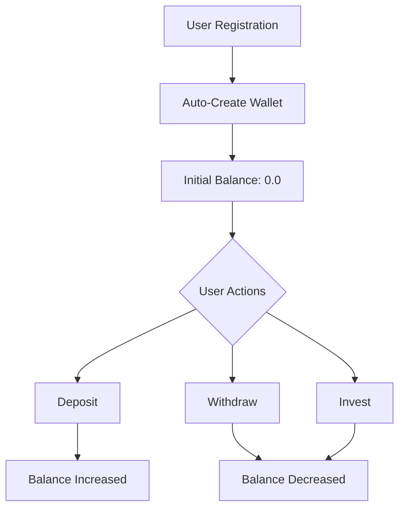

## Overview

The Wallet & Transactions feature provides a comprehensive digital wallet system for managing investor funds. Each user automatically receives a wallet (Cartera) upon registration, allowing them to deposit funds from bank accounts, withdraw to bank accounts, and track their complete transaction history.

## Key Capabilities

<CardGroup cols={2}>
  <Card title="Automatic Wallets" icon="wallet">
    Every user gets a wallet automatically created during registration with zero initial balance
  </Card>
  <Card title="Deposit & Withdraw" icon="arrow-right-arrow-left">
    Transfer funds between bank accounts and wallet with real-time balance updates
  </Card>
  <Card title="Transaction History" icon="clock-rotate-left">
    Complete audit trail of all deposits and withdrawals with timestamps
  </Card>
  <Card title="Balance Tracking" icon="scale-balanced">
    Real-time balance calculation across wallet and linked bank accounts
  </Card>
</CardGroup>

## Data Models

### Cartera (Wallet) Entity

| Field | Type | Description |
|-------|------|-------------|
| `idCartera` | int | Unique wallet identifier (auto-generated) |
| `saldo` | double | Current wallet balance |
| `idUsu` | long | User ID (foreign key to Usuario) |
| `usuario` | Usuario | Associated user entity |

<Note>
  Each user has exactly one wallet, created automatically during registration with `saldo` initialized to 0.
</Note>

### Transacciones Entity

| Field | Type | Description |
|-------|------|-------------|
| `idTransaccion` | long | Unique transaction identifier (auto-generated) |
| `monto` | double | Transaction amount |
| `fecha` | Date | Transaction date and time |
| `idCuentaBancaria` | int | Bank account ID involved in transaction |
| `cuentaBancaria` | CuentaBancaria | Bank account entity |
| `idTipoTransaccion` | long | Transaction type: 1 = Deposito, 2 = Retiro |
| `tipoTransaccion` | TipoTransaccion | Transaction type entity |

### TipoTransaccion Entity

Defines transaction types:

| ID | Type | Description |
|----|------|-------------|
| 1 | Deposito | Transfer from bank account to wallet |
| 2 | Retiro | Transfer from wallet to bank account |

## Wallet System Architecture

### Wallet Lifecycle



<Steps>
  <Step title="Wallet Creation">
    When a user registers via `POST /api/registrar`, the system automatically creates a wallet:
    
    ```java
    Cartera cartera = new Cartera();
    cartera.setSaldo(0);
    cartera.setIdUsu(objUsuario.getId());
    Cartera objCartera = carteraService.insertaActualizaCartera(cartera);
    ```
    
    See implementation in `UsuarioController.java:131-138`
  </Step>
  
  <Step title="Balance Management">
    Wallet balance is updated atomically during deposits, withdrawals, and investment transactions.
  </Step>
  
  <Step title="Transaction Recording">
    Every balance change creates a transaction record for complete audit trails.
  </Step>
</Steps>

## Transaction Workflows

### Deposit Workflow (Bank Account → Wallet)

The deposit process transfers funds from a user's bank account to their wallet:

<Steps>
  <Step title="Validate Bank Account">
    System verifies:
    - Bank account exists
    - Bank account belongs to current user
    - Bank account has sufficient balance
  </Step>
  
  <Step title="Calculate New Balances">
    ```java
    // Deduct from bank account
    double nuevoSaldoCB = saldoActualCB - transaccion.getMonto();
    
    // Add to wallet
    double nuevoSaldoCartera = saldoActualCartera + transaccion.getMonto();
    ```
  </Step>
  
  <Step title="Update Both Balances">
    Update bank account and wallet balances atomically.
  </Step>
  
  <Step title="Record Transaction">
    Create transaction record:
    - `idTipoTransaccion` = 1 (Deposito)
    - `fecha` = current date/time
    - `monto` = deposited amount
    - Link to bank account
  </Step>
</Steps>

<Accordion title="See Code Example: Deposit Transaction">
```java
// From TransaccionController.java:92-136
@PostMapping("/deposito")
public ResponseEntity<?> depositarCuenta(@RequestBody Transacciones transaccion, HttpSession session) {
    long idUsuAct = (long) session.getAttribute("idUsuActual");
    List<CuentaBancaria> lista = cuentaBancariaService.listaCuentaBancariaxIdUsuAct(idUsuAct);
    int IdCuentaB = transaccion.getIdCuentaBancaria();
    
    // Verify bank account belongs to user
    boolean existe = lista.stream().anyMatch(cuenta -> cuenta.getIdCuentaBancaria() == IdCuentaB);
    if (!existe) {
        return new ResponseEntity<>("La cuenta bancaria no existe", HttpStatus.BAD_REQUEST);
    }
    
    // Get current balances
    Cartera cartera = carteraService.buscarCartera(idUsuAct);
    double saldoActualCartera = cartera.getSaldo();
    
    Optional<CuentaBancaria> optional = cuentaBancariaService.buscarxId(IdCuentaB);
    CuentaBancaria cuenta = optional.get();
    double saldoActualCB = cuenta.getSaldo();
    
    // Verify sufficient funds in bank account
    if (saldoActualCB < transaccion.getMonto()) {
        return new ResponseEntity<>("No cuenta con saldo suficiente", HttpStatus.BAD_REQUEST);
    }
    
    // Update balances
    double nuevoSaldoCB = saldoActualCB - transaccion.getMonto();
    cuenta.setSaldo(nuevoSaldoCB);
    cuentaBancariaService.insertaActualizaCuentaBancaria(cuenta);
    
    double nuevoSaldoCartera = saldoActualCartera + transaccion.getMonto();
    cartera.setSaldo(nuevoSaldoCartera);
    carteraService.insertaActualizaCartera(cartera);
    
    // Record transaction
    transaccion.setIdTipoTransaccion(1); // Deposito
    transaccion.setFecha(new Date());
    transaccionService.insertaTransaccion(transaccion);
    
    return ResponseEntity.ok("Deposito realizado con exito");
}
```

See full implementation at `TransaccionController.java:92-136`
</Accordion>

### Withdrawal Workflow (Wallet → Bank Account)

The withdrawal process transfers funds from wallet to a bank account:

<Steps>
  <Step title="Validate Wallet Balance">
    System verifies:
    - Bank account exists
    - Bank account belongs to current user
    - Wallet has sufficient balance
  </Step>
  
  <Step title="Calculate New Balances">
    ```java
    // Add to bank account
    double nuevoSaldoCB = saldoActualCB + transaccion.getMonto();
    
    // Deduct from wallet
    double nuevoSaldoCartera = saldoActualCartera - transaccion.getMonto();
    ```
  </Step>
  
  <Step title="Update Both Balances">
    Update wallet and bank account balances atomically.
  </Step>
  
  <Step title="Record Transaction">
    Create transaction record:
    - `idTipoTransaccion` = 2 (Retiro)
    - `fecha` = current date/time
    - `monto` = withdrawn amount
    - Link to bank account
  </Step>
</Steps>

<Accordion title="See Code Example: Withdrawal Transaction">
```java
// From TransaccionController.java:138-182
@PostMapping("/retiro")
public ResponseEntity<?> retirarCuenta(@RequestBody Transacciones transaccion, HttpSession session) {
    long idUsuAct = (long) session.getAttribute("idUsuActual");
    List<CuentaBancaria> lista = cuentaBancariaService.listaCuentaBancariaxIdUsuAct(idUsuAct);
    int IdCuentaB = transaccion.getIdCuentaBancaria();
    
    // Verify bank account belongs to user
    boolean existe = lista.stream().anyMatch(cuenta -> cuenta.getIdCuentaBancaria() == IdCuentaB);
    if (!existe) {
        return new ResponseEntity<>("La cuenta bancaria no existe", HttpStatus.BAD_REQUEST);
    }
    
    // Get current balances
    Cartera cartera = carteraService.buscarCartera(idUsuAct);
    double saldoActualCartera = cartera.getSaldo();
    
    Optional<CuentaBancaria> optional = cuentaBancariaService.buscarxId(IdCuentaB);
    CuentaBancaria cuenta = optional.get();
    double saldoActualCB = cuenta.getSaldo();
    
    // Verify sufficient funds in wallet
    if (saldoActualCartera < transaccion.getMonto()) {
        return new ResponseEntity<>("No cuenta con saldo suficiente en su cartera", HttpStatus.BAD_REQUEST);
    }
    
    // Update balances
    double nuevoSaldoCB = saldoActualCB + transaccion.getMonto();
    cuenta.setSaldo(nuevoSaldoCB);
    cuentaBancariaService.insertaActualizaCuentaBancaria(cuenta);
    
    double nuevoSaldoCartera = saldoActualCartera - transaccion.getMonto();
    cartera.setSaldo(nuevoSaldoCartera);
    carteraService.insertaActualizaCartera(cartera);
    
    // Record transaction
    transaccion.setIdTipoTransaccion(2); // Retiro
    transaccion.setFecha(new Date());
    transaccionService.insertaTransaccion(transaccion);
    
    return ResponseEntity.ok("Retiro realizado con exito");
}
```

See full implementation at `TransaccionController.java:138-182`
</Accordion>

## Main API Endpoints

### Wallet Endpoints

<Tabs>
  <Tab title="Get User Wallet">
    ```http
    GET /api/detalleCartera
    ```
    Retrieves the current user's wallet details and balance.
    
    **Authentication:** Requires valid JWT token and active session.
    
    **Response:**
    ```json
    {
      "idCartera": 15,
      "saldo": 25000.50,
      "idUsu": 15,
      "usuario": {
        "id": 15,
        "nombre": "Juan",
        "username": "jperez"
      }
    }
    ```
    
    See implementation at `CarteraController.java:28-44`
  </Tab>
  
  <Tab title="List All Wallets (Admin)">
    ```http
    GET /api/admin/listarCarteras
    ```
    Admin endpoint to view all user wallets.
    
    **Response:**
    ```json
    [
      {
        "idCartera": 15,
        "saldo": 25000.50,
        "idUsu": 15
      },
      {
        "idCartera": 16,
        "saldo": 50000.00,
        "idUsu": 16
      }
    ]
    ```
    
    See implementation at `CarteraController.java:45-51`
  </Tab>
</Tabs>

### Transaction Endpoints

<Tabs>
  <Tab title="Make Deposit">
    ```http
    POST /api/deposito
    ```
    Transfer funds from bank account to wallet.
    
    **Request Body:**
    ```json
    {
      "monto": 5000.0,
      "idCuentaBancaria": 3
    }
    ```
    
    **Validations:**
    - Bank account must belong to current user
    - Bank account must have sufficient balance
    
    **Success Response:**
    ```json
    {
      "mensaje": "Deposito realizado con exito"
    }
    ```
    
    **Error Responses:**
    - `400 BAD_REQUEST`: "No cuenta con saldo suficiente en su cuenta Bancaria!"
    - `400 BAD_REQUEST`: "La cuenta bancaria con Id: X no existe"
    
    See implementation at `TransaccionController.java:92-136`
  </Tab>
  
  <Tab title="Make Withdrawal">
    ```http
    POST /api/retiro
    ```
    Transfer funds from wallet to bank account.
    
    **Request Body:**
    ```json
    {
      "monto": 2000.0,
      "idCuentaBancaria": 3
    }
    ```
    
    **Validations:**
    - Bank account must belong to current user
    - Wallet must have sufficient balance
    
    **Success Response:**
    ```json
    {
      "mensaje": "Retiro realizado con exito"
    }
    ```
    
    **Error Responses:**
    - `400 BAD_REQUEST`: "No cuenta con saldo suficiente en su cartera!"
    - `400 BAD_REQUEST`: "La cuenta bancaria con Id: X no existe"
    
    See implementation at `TransaccionController.java:138-182`
  </Tab>
</Tabs>

### Transaction History Endpoints

<Tabs>
  <Tab title="User Transactions">
    ```http
    GET /api/user/listaTransacciones
    ```
    Retrieves all transactions for the current user.
    
    **Response:**
    ```json
    [
      {
        "idTransaccion": 101,
        "monto": 5000.0,
        "fecha": "2026-03-05",
        "tipoTransaccion": {
          "idTipoTransaccion": 1,
          "tipo": "Deposito"
        },
        "cuentaBancaria": {
          "idCuentaBancaria": 3,
          "numeroCuenta": "1234567890"
        }
      },
      {
        "idTransaccion": 102,
        "monto": 2000.0,
        "fecha": "2026-03-06",
        "tipoTransaccion": {
          "idTipoTransaccion": 2,
          "tipo": "Retiro"
        },
        "cuentaBancaria": {
          "idCuentaBancaria": 3,
          "numeroCuenta": "1234567890"
        }
      }
    ]
    ```
    
    See implementation at `TransaccionController.java:63-69`
  </Tab>
  
  <Tab title="Paginated Transactions">
    ```http
    GET /api/user/listTransacciones/page/{page}
    ```
    Returns paginated transaction history (8 per page).
    
    **Path Parameters:**
    - `page` - Page number (0-indexed)
    
    **Response:**
    ```json
    {
      "content": [ /* 8 transactions */ ],
      "totalPages": 3,
      "totalElements": 24,
      "size": 8,
      "number": 0
    }
    ```
    
    See implementation at `TransaccionController.java:70-76`
  </Tab>
  
  <Tab title="Transactions by Bank Account">
    ```http
    GET /api/user/listaTransacciones/{id}
    ```
    Filters transactions by specific bank account.
    
    **Path Parameters:**
    - `id` - Bank account ID
    
    Returns transactions involving the specified bank account only.
    
    See implementation at `TransaccionController.java:78-90`
  </Tab>
  
  <Tab title="All Transactions (Admin)">
    ```http
    GET /api/admin/listaTransacciones
    ```
    Admin endpoint to view all system transactions.
    
    See implementation at `TransaccionController.java:56-61`
  </Tab>
</Tabs>

### Utility Endpoints

<Accordion title="List Transaction Types">
```http
GET /api/listaTipoTransacciones
```

Returns available transaction types.

**Response:**
```json
[
  {
    "idTipoTransaccion": 1,
    "tipo": "Deposito"
  },
  {
    "idTipoTransaccion": 2,
    "tipo": "Retiro"
  }
]
```

See implementation at `TransaccionController.java:49-54`
</Accordion>

## Use Cases

### Use Case 1: Investor Funding Their Wallet

**Scenario:** An investor wants to add funds to their wallet to invest in opportunities.

1. Investor checks wallet balance: `GET /api/detalleCartera`
   - Response shows: `saldo: 1000.0`

2. Investor decides to deposit $5,000 from bank account #3

3. Investor calls `POST /api/deposito`:
   ```json
   {
     "monto": 5000.0,
     "idCuentaBancaria": 3
   }
   ```

4. System:
   - Verifies bank account #3 belongs to investor
   - Checks bank account has at least $5,000
   - Deducts $5,000 from bank account
   - Adds $5,000 to wallet (new balance: $6,000)
   - Records transaction with `idTipoTransaccion: 1` (Deposito)

5. Investor can now use the $6,000 wallet balance to invest

### Use Case 2: Cashing Out Profits

**Scenario:** An investor received returns from investments and wants to withdraw to their bank.

1. Investor checks wallet: `GET /api/detalleCartera`
   - Response shows: `saldo: 12000.0` (original $6,000 + $6,000 returns)

2. Investor decides to withdraw $8,000 to bank account #3

3. Investor calls `POST /api/retiro`:
   ```json
   {
     "monto": 8000.0,
     "idCuentaBancaria": 3
   }
   ```

4. System:
   - Verifies bank account #3 belongs to investor
   - Checks wallet has at least $8,000
   - Adds $8,000 to bank account
   - Deducts $8,000 from wallet (new balance: $4,000)
   - Records transaction with `idTipoTransaccion: 2` (Retiro)

5. Investor retains $4,000 in wallet for future investments

### Use Case 3: Reviewing Transaction History

**Scenario:** An investor wants to review their deposit and withdrawal history.

1. Investor calls `GET /api/user/listTransacciones/page/0`

2. System returns first 8 transactions showing:
   - Transaction IDs
   - Amounts
   - Dates
   - Types (Deposito or Retiro)
   - Associated bank accounts

3. Investor can:
   - Calculate total deposits
   - Calculate total withdrawals
   - Reconcile with bank statements
   - Track account activity patterns

### Use Case 4: Admin Monitoring Platform Liquidity

**Scenario:** Admin wants to monitor total funds in the platform.

1. Admin calls `GET /api/admin/listarCarteras`

2. System returns all user wallets with balances

3. Admin calculates:
   - Total platform liquidity: sum of all `saldo` values
   - Distribution of funds across users
   - Identify high-value investors

4. Admin calls `GET /api/admin/listaTransacciones`

5. Admin analyzes:
   - Total deposits vs withdrawals
   - Platform cash flow trends
   - Most active investors

## Balance Validation

The system implements strict balance validation to prevent overdrafts:

<CardGroup cols={2}>
  <Card title="Deposit Validation" icon="arrow-down">
    Before deposit:
    ```java
    if (saldoActualCB < transaccion.getMonto()) {
        return "No cuenta con saldo suficiente";
    }
    ```
    Ensures bank account has sufficient funds.
  </Card>
  
  <Card title="Withdrawal Validation" icon="arrow-up">
    Before withdrawal:
    ```java
    if (saldoActualCartera < transaccion.getMonto()) {
        return "No cuenta con saldo suficiente en su cartera";
    }
    ```
    Ensures wallet has sufficient funds.
  </Card>
</CardGroup>

## Transaction Integrity

### Atomic Operations

Each transaction involves multiple database updates that must all succeed or all fail:

1. **Update source balance** (bank account or wallet)
2. **Update destination balance** (wallet or bank account)
3. **Create transaction record**

The service layer should wrap these operations in a transaction:

```java
@Transactional
public void procesarDeposito(Transacciones transaccion, long idUsuario) {
    // All updates within this method execute atomically
    // If any step fails, all changes are rolled back
}
```

<Warning>
  Ensure proper transaction management at the service layer to maintain data consistency. The controller implementations should delegate to transactional service methods.
</Warning>

## Best Practices

<CardGroup cols={2}>
  <Card title="Validate Ownership" icon="user-check">
    Always verify bank accounts belong to the current user before processing transactions.
  </Card>
  
  <Card title="Check Balances" icon="scale-balanced">
    Validate sufficient funds before attempting any balance update to prevent overdrafts.
  </Card>
  
  <Card title="Audit Trail" icon="list-check">
    Record every transaction with complete details (amount, date, type, account) for compliance.
  </Card>
  
  <Card title="Error Handling" icon="triangle-exclamation">
    Provide clear error messages distinguishing between insufficient funds, invalid accounts, etc.
  </Card>
</CardGroup>

## Error Handling

Common error scenarios:

| Scenario | HTTP Status | Response |
|----------|-------------|----------|
| Insufficient wallet balance | 400 BAD_REQUEST | `{"mensaje": "No cuenta con saldo suficiente en su cartera!"}` |
| Insufficient bank balance | 400 BAD_REQUEST | `{"mensaje": "No cuenta con saldo suficiente en su cuenta Bancaria!"}` |
| Bank account not owned | 400 BAD_REQUEST | `{"mensaje": "La cuenta bancaria con Id: X no existe"}` |
| Wallet not found | 404 NOT_FOUND | `{"mensaje": "El no se encontro la cartera..."}` |

## Related Features

- [User Management](/features/user-management) - Automatic wallet creation during user registration
- [Investment Opportunities](/features/investment-opportunities) - Use wallet funds to invest in opportunities
