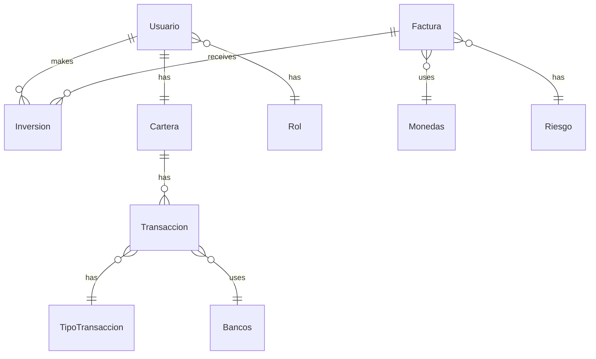

## Overview

InvestGo uses MySQL as its primary database for storing users, invoices, investments, transactions, and related data. The application is configured with Hibernate JPA for ORM and includes automatic schema creation and initial data seeding.

## Database Requirements

### Prerequisites

- **MySQL Version**: 8.0 or higher recommended
- **Character Set**: UTF-8 (default)
- **Storage Engine**: InnoDB (default)
- **Minimum Storage**: 100MB initial, scale as needed
- **Database Name**: `InvestGo`

### MySQL Installation

<CodeGroup>
```bash Ubuntu/Debian
sudo apt update
sudo apt install mysql-server
sudo systemctl start mysql
sudo systemctl enable mysql

# Secure installation
sudo mysql_secure_installation
```

```bash macOS (Homebrew)
brew install mysql
brew services start mysql

# Secure installation
mysql_secure_installation
```

```bash Windows
# Download MySQL installer from:
# https://dev.mysql.com/downloads/installer/

# Or use Chocolatey
choco install mysql
```

```bash Docker
docker run --name investgo-mysql \
  -e MYSQL_ROOT_PASSWORD=1234 \
  -e MYSQL_DATABASE=InvestGo \
  -p 3306:3306 \
  -d mysql:8.0
```
</CodeGroup>

## Database Creation

### Manual Setup

<Steps>
  <Step title="Connect to MySQL">
    ```bash
    mysql -u root -p
    ```
    Enter your root password when prompted.
  </Step>
  
  <Step title="Create Database">
    ```sql
    CREATE DATABASE InvestGo;
    ```
  </Step>
  
  <Step title="Create Database User (Optional but Recommended)">
    ```sql
    CREATE USER 'investgo_user'@'localhost' IDENTIFIED BY 'secure_password';
    GRANT ALL PRIVILEGES ON InvestGo.* TO 'investgo_user'@'localhost';
    FLUSH PRIVILEGES;
    ```
  </Step>
  
  <Step title="Verify Database">
    ```sql
    SHOW DATABASES;
    USE InvestGo;
    ```
  </Step>
</Steps>

<Info>
  The application will automatically create all required tables on first run using Hibernate's `ddl-auto=update` setting.
</Info>

## Application Configuration

### application.properties

From `src/main/resources/application.properties`:

<CodeGroup>
```properties Default Configuration
# Server Port
server.port=8091

# Database Configuration
spring.jpa.database=MYSQL
spring.jpa.show-sql=true
spring.datasource.driver-class-name=com.mysql.cj.jdbc.Driver
spring.datasource.url=jdbc:mysql://localhost:3306/InvestGo
spring.datasource.username=root
spring.datasource.password=1234

# Hibernate Configuration
spring.jpa.properties.hibernate.dialect=org.hibernate.dialect.MySQL8Dialect
spring.jpa.hibernate.ddl-auto=update
spring.jpa.properties.hibernate.format_sql=true
```

```properties Production Configuration
# Server Port
server.port=8091

# Database Configuration
spring.jpa.database=MYSQL
spring.jpa.show-sql=false  # Disable SQL logging in production
spring.datasource.driver-class-name=com.mysql.cj.jdbc.Driver
spring.datasource.url=jdbc:mysql://prod-db-server:3306/InvestGo?useSSL=true
spring.datasource.username=${DB_USERNAME}  # Use environment variables
spring.datasource.password=${DB_PASSWORD}  # Use environment variables

# Hibernate Configuration
spring.jpa.properties.hibernate.dialect=org.hibernate.dialect.MySQL8Dialect
spring.jpa.hibernate.ddl-auto=validate  # Don't auto-update in production
spring.jpa.properties.hibernate.format_sql=false

# Connection Pool
spring.datasource.hikari.maximum-pool-size=10
spring.datasource.hikari.minimum-idle=5
```

```properties Docker/Container Configuration
# Server Port
server.port=8091

# Database Configuration (Docker service name as host)
spring.jpa.database=MYSQL
spring.jpa.show-sql=true
spring.datasource.driver-class-name=com.mysql.cj.jdbc.Driver
spring.datasource.url=jdbc:mysql://mysql-container:3306/InvestGo
spring.datasource.username=root
spring.datasource.password=1234

# Hibernate Configuration
spring.jpa.properties.hibernate.dialect=org.hibernate.dialect.MySQL8Dialect
spring.jpa.hibernate.ddl-auto=update
spring.jpa.properties.hibernate.format_sql=true
```
</CodeGroup>

### Configuration Properties Explained

| Property | Value | Description |
|----------|-------|-------------|
| `server.port` | `8091` | Tomcat server port |
| `spring.jpa.database` | `MYSQL` | Database type |
| `spring.jpa.show-sql` | `true` | Log SQL queries to console (disable in production) |
| `spring.datasource.driver-class-name` | `com.mysql.cj.jdbc.Driver` | MySQL JDBC driver |
| `spring.datasource.url` | `jdbc:mysql://localhost:3306/InvestGo` | Database connection URL |
| `spring.datasource.username` | `root` | Database username |
| `spring.datasource.password` | `1234` | Database password |
| `hibernate.dialect` | `MySQL8Dialect` | Hibernate SQL dialect for MySQL 8 |
| `ddl-auto` | `update` | Auto-update schema on changes |
| `hibernate.format_sql` | `true` | Format SQL output for readability |

<Warning>
  **Security Warning**: The default configuration uses simple credentials (`root` / `1234`). This is acceptable for local development but MUST be changed for production environments. Use environment variables or secure configuration management.
</Warning>

## Schema Creation (ddl-auto)

### Automatic Schema Management

With `spring.jpa.hibernate.ddl-auto=update`, Hibernate automatically:

- Creates tables if they don't exist
- Adds new columns when entities are modified
- Does NOT remove columns or tables
- Updates relationships and constraints

### DDL-Auto Options

| Option | Behavior | Use Case |
|--------|----------|----------|
| `none` | No automatic schema management | Manual control |
| `validate` | Validate schema matches entities | Production (safest) |
| `update` | Update schema to match entities | Development |
| `create` | Drop and recreate schema on startup | Testing |
| `create-drop` | Drop schema on shutdown | Integration tests |

<Info>
  **Recommendation**: Use `update` for development, but switch to `validate` in production and manage schema changes with migration tools like Flyway or Liquibase.
</Info>

## Initial Data Seeding

The application automatically seeds essential data on first startup through `CommandLineRunner` in `SistemaFactoringBackendApplication.java:51-140`.

### Seeded Data Overview

<Steps>
  <Step title="Roles">
    Two user roles are created:
    - **INVERSIONISTA** (ID: 1)
    - **ADMIN** (ID: 2)
  </Step>
  
  <Step title="Admin User">
    Default administrator account with full system access.
  </Step>
  
  <Step title="Transaction Types">
    - Deposito (Deposit)
    - Retiro (Withdrawal)
  </Step>
  
  <Step title="Banks">
    Seven major Peruvian banks are pre-configured.
  </Step>
  
  <Step title="Currencies">
    Two supported currencies:
    - PEN (Peruvian Sol)
    - USD (US Dollar)
  </Step>
  
  <Step title="Risk Levels">
    Three investment risk categories (A, B, C).
  </Step>
</Steps>

### Detailed Seed Data

<Accordion title="Roles (2 records)">
  ```sql
  -- INVERSIONISTA
  INSERT INTO Rol (tipo) VALUES ('INVERSIONISTA');
  
  -- ADMIN
  INSERT INTO Rol (tipo) VALUES ('ADMIN');
  ```
  
  **Implementation**: Lines 56-62 in `SistemaFactoringBackendApplication.java`
</Accordion>

<Accordion title="Admin User (1 record)">
  ```sql
  INSERT INTO Usuario (
    nombre, apellidoPa, apellidoMa, telefono, correo, 
    username, password, foto, fecha, dni, enable, idTipoUsu
  ) VALUES (
    'Jeimy',
    'Apolaya',
    'Jurado',
    '938311721',
    'apolaya@gmail.com',
    'jamie',
    '$2a$10$...',  -- BCrypt hash of 'Admin12345'
    'foto.png',
    NOW(),
    '77454558',
    'Activo',
    2  -- ADMIN role
  );
  
  -- Initial wallet with 10 million soles
  INSERT INTO Cartera (saldo, idUsu) VALUES (10000000, 1);
  ```
  
  **Login Credentials**:
  - Username: `jamie`
  - Password: `Admin12345`
  - Initial Balance: S/. 10,000,000
  
  **Implementation**: Lines 65-85 in `SistemaFactoringBackendApplication.java`
</Accordion>

<Accordion title="Transaction Types (2 records)">
  ```sql
  INSERT INTO TipoTransaccion (tipo) VALUES ('Deposito');
  INSERT INTO TipoTransaccion (tipo) VALUES ('Retiro');
  ```
  
  **Implementation**: Lines 87-97 in `SistemaFactoringBackendApplication.java`
</Accordion>

<Accordion title="Banks (7 records)">
  ```sql
  INSERT INTO Bancos (nomBancos) VALUES 
    ('Banco continental BBVA '),
    ('Banco de credito BCP'),
    ('Scotiabank'),
    ('Interbank'),
    ('Dinners Club'),
    ('Banbif'),
    ('American Express');
  ```
  
  **Implementation**: Lines 99-110 in `SistemaFactoringBackendApplication.java`
</Accordion>

<Accordion title="Currencies (2 records)">
  ```sql
  INSERT INTO Monedas (nomMonedas, valorMoneda) VALUES 
    ('PEN', 'S/.'),
    ('USD', '$');
  ```
  
  **Implementation**: Lines 112-122 in `SistemaFactoringBackendApplication.java`
</Accordion>

<Accordion title="Risk Levels (3 records)">
  ```sql
  INSERT INTO Riesgo (rango, descripcion) VALUES 
    ('A', 'El riesgo de inversion es nulo!'),
    ('B', 'El riesgo de inversion es CASI nulo!'),
    ('C', 'El riesgo de inversion algo elevado');
  ```
  
  **Risk Categories**:
  - **A**: Minimal risk (safest investments)
  - **B**: Near-zero risk
  - **C**: Elevated risk (higher returns, higher risk)
  
  **Implementation**: Lines 124-136 in `SistemaFactoringBackendApplication.java`
</Accordion>

<Info>
  Seed data is only inserted if the corresponding records don't already exist. The application checks for existence before seeding to avoid duplicates on restarts.
</Info>

## Table Structure and Relationships

### Core Tables

The application manages the following main entities:



### Table Descriptions

| Table | Purpose | Key Relationships |
|-------|---------|-------------------|
| `Usuario` | User accounts (investors & admin) | Has one `Cartera`, belongs to `Rol` |
| `Rol` | User roles (ADMIN, INVERSIONISTA) | Has many `Usuario` |
| `Cartera` | User wallet/balance | Belongs to `Usuario`, has many `Transaccion` |
| `Factura` | Invoices available for factoring | Has many `Inversion`, uses `Monedas` and `Riesgo` |
| `Inversion` | Investment records | Belongs to `Usuario` and `Factura` |
| `Transaccion` | Financial transactions | Belongs to `Cartera`, uses `TipoTransaccion` and `Bancos` |
| `TipoTransaccion` | Transaction types (Deposit/Withdrawal) | Has many `Transaccion` |
| `Bancos` | Supported banks | Has many `Transaccion` |
| `Monedas` | Currencies (PEN, USD) | Has many `Factura` |
| `Riesgo` | Risk levels (A, B, C) | Has many `Factura` |

## Database Migration Considerations

### From Development to Production

When moving to production, consider these migration strategies:

<Steps>
  <Step title="Disable Auto-Update">
    Change `ddl-auto` from `update` to `validate`:
    ```properties
    spring.jpa.hibernate.ddl-auto=validate
    ```
  </Step>
  
  <Step title="Generate Initial Schema">
    Use Hibernate to generate the initial schema DDL:
    ```bash
    # Add to application.properties temporarily
    spring.jpa.properties.javax.persistence.schema-generation.scripts.action=create
    spring.jpa.properties.javax.persistence.schema-generation.scripts.create-target=create.sql
    ```
  </Step>
  
  <Step title="Implement Migration Tool">
    Add Flyway or Liquibase for version-controlled migrations:
    
    **Flyway** (recommended):
    ```xml
    <dependency>
        <groupId>org.flywaydb</groupId>
        <artifactId>flyway-core</artifactId>
    </dependency>
    ```
    
    ```properties
    spring.flyway.enabled=true
    spring.flyway.baseline-on-migrate=true
    ```
  </Step>
  
  <Step title="Version Control Migrations">
    Create migration files for schema changes:
    ```
    src/main/resources/db/migration/
      V1__initial_schema.sql
      V2__add_user_phone_verification.sql
      V3__add_investment_indexes.sql
    ```
  </Step>
</Steps>

<Warning>
  **Critical**: Never use `ddl-auto=update` or `ddl-auto=create` in production. Always use `validate` and manage schema changes through migration tools.
</Warning>

## Connection Testing

### Verify Database Connectivity

<CodeGroup>
```bash MySQL Command Line
mysql -u root -p -h localhost -P 3306 InvestGo
```

```bash Test from Application
# Check application logs on startup
# Should see:
# - Hibernate: create table ... (first run)
# - "Roles registrado con exito!"
# - "USUARIO registrado con exito!"
# - "Tipos registrado con exito!"
# - "Se registro el banco: ..."
# - "Se registro la moneda: ..."
# - "Se registro el riesgo: ..."
```

```sql Verify Seed Data
-- Connect to database
USE InvestGo;

-- Check roles
SELECT * FROM Rol;
-- Expected: 2 rows (INVERSIONISTA, ADMIN)

-- Check admin user
SELECT username, nombre, correo, idTipoUsu FROM Usuario WHERE id = 1;
-- Expected: jamie, Jeimy, apolaya@gmail.com, 2

-- Check wallet
SELECT * FROM Cartera WHERE idUsu = 1;
-- Expected: saldo = 10000000

-- Check banks
SELECT COUNT(*) FROM Bancos;
-- Expected: 7

-- Check currencies
SELECT * FROM Monedas;
-- Expected: 2 rows (PEN, USD)

-- Check risk levels
SELECT * FROM Riesgo;
-- Expected: 3 rows (A, B, C)
```

```java Spring Boot Test
@SpringBootTest
class DatabaseConnectionTest {
    
    @Autowired
    private DataSource dataSource;
    
    @Test
    void testDatabaseConnection() throws SQLException {
        try (Connection conn = dataSource.getConnection()) {
            assertTrue(conn.isValid(1));
            assertEquals("InvestGo", conn.getCatalog());
        }
    }
}
```
</CodeGroup>

## Common Database Issues

<Accordion title="Connection Refused">
  **Error**: `com.mysql.cj.jdbc.exceptions.CommunicationsException: Communications link failure`
  
  **Possible Causes**:
  - MySQL server not running
  - Wrong host or port in connection URL
  - Firewall blocking connection
  
  **Solutions**:
  ```bash
  # Check MySQL status
  sudo systemctl status mysql
  
  # Start MySQL
  sudo systemctl start mysql
  
  # Check port
  netstat -tlnp | grep 3306
  ```
</Accordion>

<Accordion title="Access Denied for User">
  **Error**: `java.sql.SQLException: Access denied for user 'root'@'localhost'`
  
  **Possible Causes**:
  - Wrong username or password in `application.properties`
  - User doesn't have privileges on database
  
  **Solutions**:
  ```sql
  -- Reset root password
  ALTER USER 'root'@'localhost' IDENTIFIED BY 'new_password';
  
  -- Grant privileges
  GRANT ALL PRIVILEGES ON InvestGo.* TO 'root'@'localhost';
  FLUSH PRIVILEGES;
  ```
</Accordion>

<Accordion title="Database Does Not Exist">
  **Error**: `java.sql.SQLSyntaxErrorException: Unknown database 'InvestGo'`
  
  **Solution**:
  ```sql
  CREATE DATABASE InvestGo;
  ```
  
  Or enable automatic creation (development only):
  ```properties
  spring.datasource.url=jdbc:mysql://localhost:3306/InvestGo?createDatabaseIfNotExist=true
  ```
</Accordion>

<Accordion title="Table Already Exists">
  **Error**: `Table 'Usuario' already exists`
  
  **Cause**: Usually occurs with `ddl-auto=create` when tables exist
  
  **Solutions**:
  - Change to `ddl-auto=update`
  - Drop and recreate database (development only)
  ```sql
  DROP DATABASE InvestGo;
  CREATE DATABASE InvestGo;
  ```
</Accordion>

<Accordion title="Hibernate Dialect Error">
  **Error**: `org.hibernate.HibernateException: Access to DialectResolutionInfo cannot be null`
  
  **Solution**: Ensure MySQL8Dialect is specified:
  ```properties
  spring.jpa.properties.hibernate.dialect=org.hibernate.dialect.MySQL8Dialect
  ```
</Accordion>

## Performance Optimization

### Connection Pool Configuration

For production environments, configure HikariCP (default in Spring Boot):

```properties
# Connection Pool Settings
spring.datasource.hikari.maximum-pool-size=20
spring.datasource.hikari.minimum-idle=5
spring.datasource.hikari.connection-timeout=30000
spring.datasource.hikari.idle-timeout=600000
spring.datasource.hikari.max-lifetime=1800000

# Performance Settings
spring.datasource.hikari.auto-commit=true
spring.datasource.hikari.pool-name=InvestGoHikariCP
```

### Database Indexes

Consider adding indexes for frequently queried columns:

```sql
-- Index on Usuario username (for login)
CREATE INDEX idx_usuario_username ON Usuario(username);

-- Index on Factura status and date
CREATE INDEX idx_factura_status ON Factura(estado);
CREATE INDEX idx_factura_fecha ON Factura(fechaEmision);

-- Index on Inversion for user queries
CREATE INDEX idx_inversion_usuario ON Inversion(idUsuario);
CREATE INDEX idx_inversion_factura ON Inversion(idFactura);

-- Index on Transaccion for history queries
CREATE INDEX idx_transaccion_cartera ON Transaccion(idCartera);
CREATE INDEX idx_transaccion_fecha ON Transaccion(fecha);
```

### Query Optimization

Enable query logging to identify slow queries:

```properties
# Development
spring.jpa.show-sql=true
logging.level.org.hibernate.SQL=DEBUG
logging.level.org.hibernate.type.descriptor.sql.BasicBinder=TRACE

# Production (use external monitoring)
spring.jpa.show-sql=false
```

## Backup and Recovery

### Backup Strategy

<CodeGroup>
```bash Full Backup
# Backup entire database
mysqldump -u root -p InvestGo > investgo_backup_$(date +%Y%m%d).sql

# Backup with compression
mysqldump -u root -p InvestGo | gzip > investgo_backup_$(date +%Y%m%d).sql.gz
```

```bash Backup Specific Tables
# Backup only critical tables
mysqldump -u root -p InvestGo Usuario Cartera Inversion Factura > critical_tables_backup.sql
```

```bash Automated Daily Backup (Cron)
# Add to crontab
0 2 * * * /usr/bin/mysqldump -u root -pYourPassword InvestGo | gzip > /backups/investgo_$(date +\%Y\%m\%d).sql.gz
```
</CodeGroup>

### Recovery

```bash
# Restore from backup
mysql -u root -p InvestGo < investgo_backup_20260305.sql

# Restore from compressed backup
gunzip < investgo_backup_20260305.sql.gz | mysql -u root -p InvestGo
```

## Related Configuration Files

- **Database Properties**: `src/main/resources/application.properties`
- **Seed Data Logic**: `src/main/java/com/proyecto/integrador/SistemaFactoringBackendApplication.java`
- **Entity Definitions**: `src/main/java/com/proyecto/integrador/entidades/`
- **Service Layers**: `src/main/java/com/proyecto/integrador/servicios/`

## Next Steps

- Configure [Authentication](/guides/authentication)
- Review [Security Settings](/guides/security)
- Explore [API Endpoints](/api/auth)